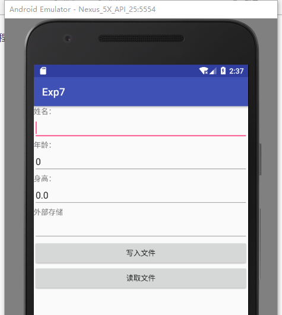
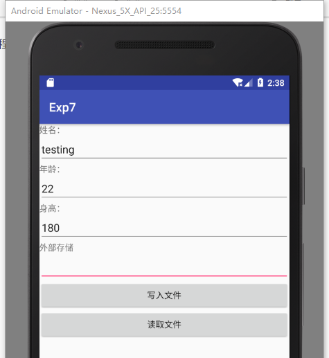
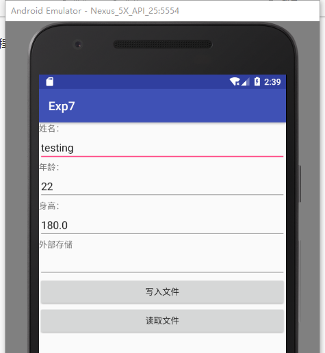
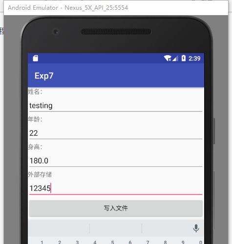
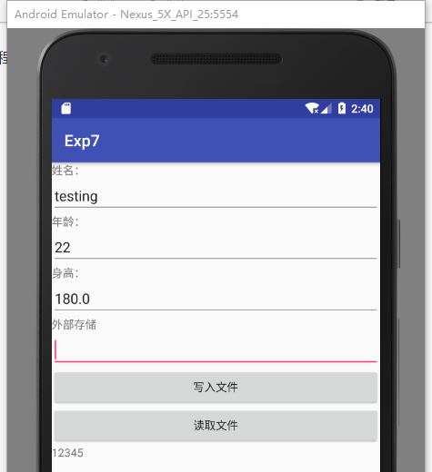

# 实验7： 数据临时存储

应用程序在使用过程中会被用户或系统关闭，如果能够在程序关闭前保存用户输入的信息，就可以在程序再次启动程序时恢复这些信息，进而提升用户体验。

（1）尝试使用SharedPreferences在程序关闭时保存用户输入的信息，并在程序重新启动时自动恢复这些信息。

（2）以INI文件的形式，将数据保存在内部或外部存储器上，实现相同的功能。

## （1）使用SharedPreferences在程序关闭时保存用户输入的信息，并在程序重新启动时自动恢复这些信息：

输入姓名“testing”，年龄“22”，身高“180”。

关闭程序，重启，自动恢复了之前所输入的这些信息。

## （2）以INI文件的形式，将数据保存在内部或外部存储器上，实现相同的功能：

输入12345，点击“写入文件”，将数据保存在内部ini文件上。

再点击“读取文件”，读取ini文件数据。

